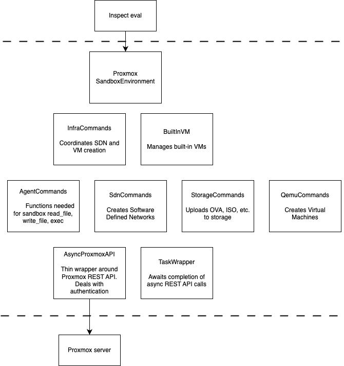

# Contributing Guide

**NOTE:** If you have any feature requests or suggestions, we'd love to hear about them
and discuss them with you before you raise a PR. Please come discuss your ideas with us
in our [Inspect
Community](https://join.slack.com/t/inspectcommunity/shared_invite/zt-2w9eaeusj-4Hu~IBHx2aORsKz~njuz4g)
Slack workspace.

## Getting started

This project uses [uv](https://github.com/astral-sh/uv) for Python packaging.

Run this beforehand:

```
uv sync
```

You then can either source the venv with

```
source .venv/bin/activate
```

or prefix your pytest (etc.) commands with `uv run ...`

## Local Proxmox

If you want to spin up a Proxmox instance locally, you can use the script `src/proxmoxsandbox/scripts/virtualized_proxmox/build_proxmox_auto.sh`.
It has been tested on Ubuntu 24.04.

It will handle the extra configuration mentioned in this project's README.

## Tests

To run the tests, you will need a proxmox instance and an .env file per README.md.

If running from the CLI, you'll need to run first `set -a; source .env; set +a`.

Then run:

```
uv run pytest
```

The tests require your Proxmox node to have at least 3 vCPUs available.

## Linting & Formatting

[Ruff](https://docs.astral.sh/ruff/) is used for linting and formatting. To run both
checks manually:

```bash
uv run ruff check .
uv run ruff format .
```

## Type Checking

[Mypy](https://github.com/python/mypy) is used for type checking. To run type checks
manually:

```bash
mypy
```

## Design Notes

All communication with Proxmox is via the AsyncProxmoxAPI class.



### Lack of URL constants

The URLs for each REST call tend to be inline in the part of the code making the call; 
this is deliberate, to keep things simple and to avoid premature indirection. 


### Limitations

The design of this provider is constrained by what is offered by the 
[Proxmox REST API](https://pve.proxmox.com/wiki/Proxmox_VE_API). 
For example, OVA is the only supported upload format. It would be useful to be able to upload qcow2 disk images,
but this isn't supported.

### Cleanup

There are two paths for cleaning up resources. The normal, "happy", path, is via `ProxmoxSandboxEnvironment`'s  `all_vm_ids` and `sdn_zone_id`
fields. These are populated during sample setup.

However, the user can press Ctrl-C, per the [Inspect docs](https://inspect.aisi.org.uk/sandboxing.html#environment-cleanup): so the 
`QemuCommands` and `SdnCommands` use context variables to keep track of created resources, and tear down in a separate way via
`InfraCommands.cleanup()`.